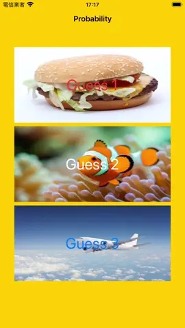

# WWMachineLearning+Resnet50
[](https://developer.apple.com/swift/) [](https://developer.apple.com/swift/)  [](https://developer.apple.com/swift/) [](https://developer.apple.com/swift/)

### [Introduction - 簡介](https://swiftpackageindex.com/William-Weng)
- [Use Apple's ResNet (Residual Neural Network) model to determine the probability of what the object in the picture is.](https://developer.apple.com/machine-learning/models/)
- [利用APPLE的ResNet (Residual Neural Network) 模型來分辨圖片上物體是什麼的機率。](https://medium.com/彼得潘的-swift-ios-app-開發教室/swiftui-使用-coreml-進行圖像辨識-ce02a92573f6)



### [Installation with Swift Package Manager](https://medium.com/彼得潘的-swift-ios-app-開發問題解答集/使用-spm-安裝第三方套件-xcode-11-新功能-2c4ffcf85b4b)

```bash
dependencies: [
    .package(url: "https://github.com/William-Weng/WWMachineLearning_Resnet50.git", .upToNextMajor(from: "1.1.0"))
]
```

### Function - 可用函式
|函式|功能|
|-|-|
|loadModel(type:progress:completion:)|載入模型 (從快取 or 網路重新下載)|
|loadModel(type:)|載入模型 (從快取 or 網路重新下載)|
|probability(image:completion:)|分析圖片是什麼物體|
|probability(image:)|分析圖片是什麼物體|
|probabilities(image:standardValue:completion:)|分析圖片哪一些物體們的機率|
|probabilities(image:standardValue:)|分析圖片哪一些物體們的機率|

### Example
```swift
import UIKit
import WWMachineLearning_Resnet50

final class ViewController: UIViewController {
    
    override func viewDidLoad() {
        super.viewDidLoad()
        
        Task {
            _ = await WWMachineLearning.Resnet50.shard.loadModel()
        }
    }
    
    @IBAction func probabilityTest(_ sender: UIButton) {
        
        let image = sender.backgroundImage(for: .normal)
        
        Task {
            switch await WWMachineLearning.Resnet50.shard.probability(image: image) {
            case .failure(let error): sender.setTitle(error.localizedDescription, for: .normal)
            case .success(let info):
                sender.setTitle(info.label, for: .normal)
                title = "\(info.probability * 100.0) %"
            }
        }
    }
}
```
